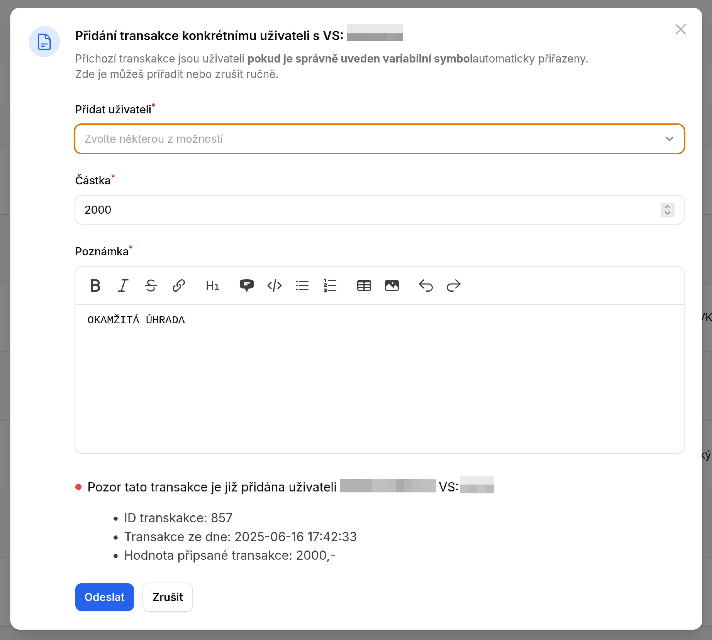

# Bankovní výpis <Badge type="info" text="FINANČNÍK" />

Stránka slouží k zobrazení transakcí na sledovaných bankovních účtech. Aktuálně je možné v systému sledovat výpis z bank
**Moneta Money Bank** a **Fio Bank**. Propojení na banku je popsáno na stránce [instalace systému](/install/bank-connector).

Co je potřeba k automatickému párování plateb nastavit je popsáno na stránce instalace.

Na stránku bankovního výpisu se dostaneme z postraního menu z odkazu **Bankovní výpis**. Na stránce můžeme vidět/provádět
1. **Odkaz** na stránku
2. **Vidíme debetní položky** s detailem a popisem transkace
3. **Vidíme kreditní položky** s detailem a popisem transakce
4. **Vidíme navazující účtní položku** uživatele
5. **Možnost upravit popis transakce**
6. Možnost **ručně přida navazující účetní operace**

::: tip
Ve sloupci Variabilní symbol jsou informace **variabilní symbol** a **účet** ze kterého byla transakce provedena.
:::

## ID transakce uživatele

Pokud je na položku navázána interní transakce uživatele, je v tomto sloupci uvedena a lze se na první transakci skrze link přímo prokliknout.
Pokud je na transakci navázáno více interních položek, je zde uveden počet těchto interních položek. 

Konkrétní výpis lze vidět v modálním okně vyvolaném z menu **Přidat transakci uživateli**.

## Popis transakce

Správce financí si může různě popisovat bankovní transakce pro lepší přehled.

)

## Přidat transakci uživateli

Pokud není transakce automaticky přiřazena uživateli a měla by, může jí na této stránce správce **přiřadit ručně**. 

Částku může rozdělit a přiřadit více uživatelům. **Seznam všech interních transakcí** které jsou vázány na tento záznam z BU, je vidět v modálním okně jako výpis navazujících transakcí v seznanu vytvořených navázných interních záznamů.

Většinou se však jedná o jednu transakci jednomu uživateli připsané v plné výši viz ukázka.

