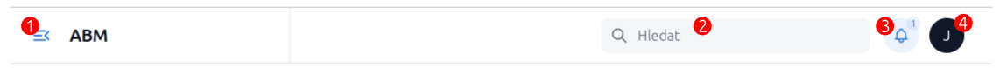
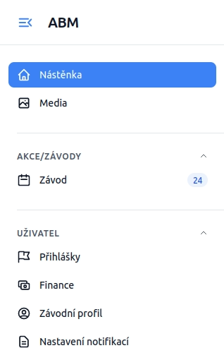
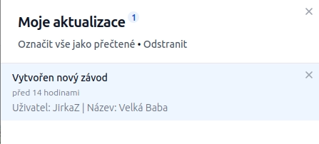

# Jak používat aplikaci <Badge type="info" text="nové" />

Na této stránce je stručně popsáno jak se obecně chová aplikace. Stránky jsou sestaveny
z jednotných komponent, chování by mělo být cca všude konzistentní. Tak jak se chová aplikace na
jedné stránce, bude se chovat obdobně i na ostatní.

::: info
Pokud byste našli jakoukoliv chybu prosím ozvěte se mi na.
:::

## Horní panel

Horní panel je dostupný na všech stránkách. V horním panelu najdete z leva do prava:

- **tlačítko změnšující/zvětšující levý sloupec (1)** menu (vhodné u monitorů s menší šířkou pro tablety telefony)
 - **hledat (2)** dialog, hledá globálně v celém systému ale jen věci které správce určitl že mají být zařazeny do výsledků hledání.
- **ikona zvonku (3)** - zobrazuje/skrývá výsuvné pravé menu kde se zobrazují notifikace
- **rozvírací ikona menu (4)** Obsahuje iniciály přihlášenéo uživatele
    - toggle na zapnutí/vypnutí dárk módu
    - tlačítko na odhlášení ze systému

## Levý panel

V levém panelu vidí uživatel dostupné stránky. V základu by měl vidět hlavní stránku
plus správu vlastního profilu.

Podle práv jaké mu jsou přidány pak může spravovat i další sekce systémy.

### Pravý výsuvný panel notifikace

Pravý panel se skrývá/zobrazuje kliknutím na ikonu zvonku v záklaví stránky. Notifikace
jsou personalisovány, závislé na tom do jaké role je uživatel zařazen. Notifikace jsou 
uchovány v databázi do doby než je uživatel sám nesmaže odkazem křížku nebo odkazem
**Odstranit**.

## Ovládání tabulkových výpisů

Pokud se na stránce zobrazí tabulkový výpis hodnot, budete jej pravidla moci ovládat následujícími
prvky.
- **hledat pomocí dialogu s lupou** - vyhledává čísti textu ve vybraných prvcích tabulky
- **řadit** (vzestupně/sestupně) - konkrétní sloupce
- **aplikovat filtry** nad zobrazenými daty

::: info
Veškeré filtrování se sčítá, tzn. pokud zvolíte hledání omezí se další vysledky pouze na hledané znaky. 
Dále si můžete vysledky seřidit vzestupně a přidat další filtr.
:::

### Hledání

Hledání je možné ve vybraných sloupcích tabulky skrze textové pole Hledat s lupou.

### Řazení

Pokud je v záhlaví stránek u jednotlivých sloupců šipky nahoru/dolu, je možné daný sloupec
řadit vzestupně/sestupně. Aktuální řazení je zvýrazněno tmavou šipkou. Ostatní šipky řazení 
jsou pak šedou barvou

::: tip
Řazení je vždy kombinováno s ostatním filtrováním. Řazení pouze upravuje pořadí výsledků.
:::

### Filtrování

Pokud je tato funkce povolena, umožňuje výpis filtrovat výsledky. Fitry jsou dostupné
pod ikonou trychtýře. Pokud je u ikony trychtýře nějaké číslo, znamená to že je nad 
výpisem aktivní již jeden filtr. Hodnota udává kolik filtrů je aktivních na výpisem.

::: tip
Aktivní filtry vidíte těsně nad názvy sloupců. Filtry se skládají za sebou. Ikonou křížku
je možné konkrétní fitr resetovat/smazat. Případně smazat všechny filtry velkým křížkem 
na konci řádků s filtry.

Řazení je pak aplikováno na výsledky ovlivněné filtrem.
:::

### Hromadné operace

V některých výpisech je možné jednotlivé řádky označit a následně provádět nad zvolenými záznamy
provádět změny, například provádět hromadnou aktualizaci nebo export zvolených věcích.

### Omezení záznanů na stránku / stránkování <Badge type="danger" text="ROZŠÍŘIT" />

V zápatí stránky tabulkových výpisů je možné v záznamech stránkovat.

