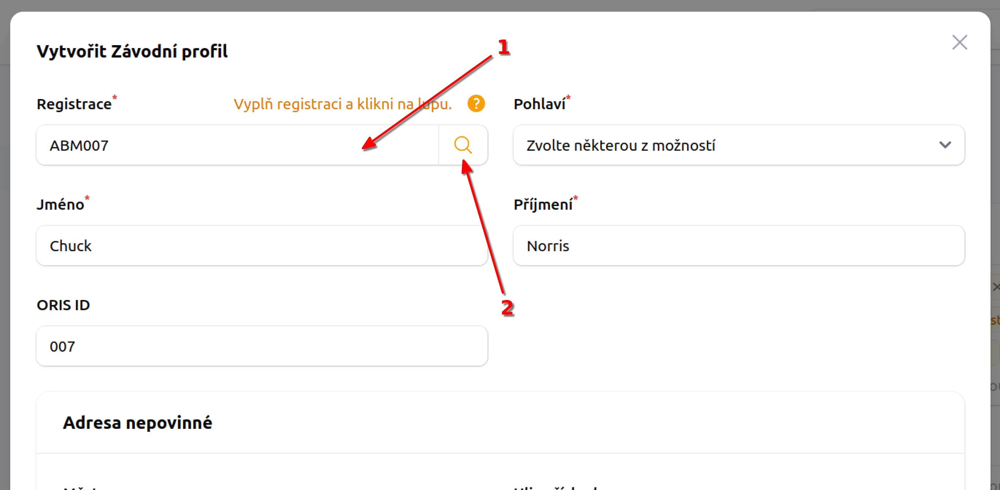

# Jak přidat uživateli registraci <Badge type="info" text="Admin klubu" />

::: warning Před přidáním registrace
Ujisti se že je platná registrace v ORISu, má vyplněny všechny platné náležitosti a má uhrazenou registraci na daný rok. V opračném případě nebude pravděpodobně fungovat přihlášení na závody.
:::

1. V menu **Uživatelé** najdi konkrétního uživatele, kterému chceš registraci přidat.
2. **Klikni** na **uživatele** pro zobrazení podrobností
3. V tabulce Závodní profil klikni na tlačítko **Vytvořit**.
4. V otevřeném dialogu vyplň **platné registrační číslo** _(1)_ a klikni na ikonu lupy _(2)_.
5. Z ORISu by se mělo dpolnit minimálně _jméno_, _příjmení_ a hlavně _ORIS ID_.
6. Vyplň ostatní náležitosti a klikni na tlačítko `Vytvořit`.

## Upravit závodní profil

Po úpravu je možné postupovat stejně jen klikni na řádku závodního profilu na tři tečky a zvol **Upravit**.

::: tip Tip
Ikona lupy funguje i v případě kdy upravuješ registraci. Pokud jenom chceš zaktualizovat data oproti ORISu, klikni na ikonu lupy.
:::