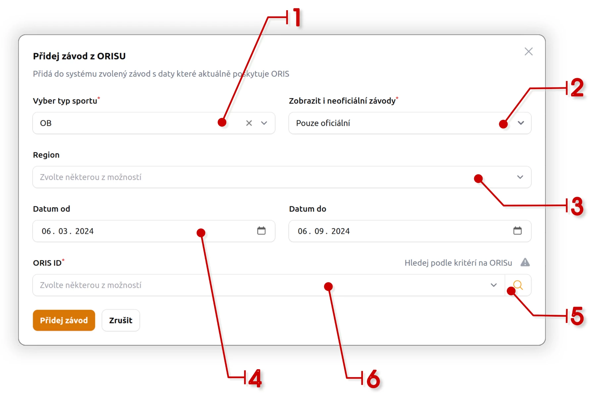

# Jak přidat nový závod z ORISu <Badge type="warning" text="SPRÁVCE ZÁVODU" />

## Závody vedeny v ORISu

Na stránce [Závody/Akce](stranka-zavody-akce) klinete na tlačítko **Přidat závod z ORISu**. V otevřeném dialogu postupujte podle návodu.

1. **Typ sportu**:small_orange_diamond: - předvolený OB
2. **Zahrnovat i neoficiální závody** - ve výchozím pouze oficiální
3. **Region** - ve výchozím nerozlišeno, bude hledat ve všech regionech
4. :calendar: **Datum od** - lze omezit na konkrétní datum od kterého hledá závody. ve výchozím vezme závody z aktuálního kalendářního roku
5. **ORIS ID**:small_orange_diamond: kliknutím na ikonu **lupy** :mag: jsou z ORISu načteny relevatní závody podle výše zvolených kritérii.
6. V rozvíracím menu zvolíte konkrétní závod, kterých chcete do systému přidat.

Kliknutím na tlačítko **`Přidej závod`** daný závod do systému přidáte.

::: tip Rozmezí data hledání závodu
Hodnoty `Datum od` a `Datum do`, mají nastaven interval půl roku. V tomto rozmezí se budou hledat závody podle kritérií na ORISu.
Pokud potřebujete starší nebo nobější závod, stačil limity posunout
:::

-------

:tada: **Tímto je vše hotovo**. Pokud nechce správce závodů provádět další specifikcká nastavení k závodu, není potřeba další akce.

Závody jsou pravidelně _aktualizovány_ s ORIS-em. Aktuálně, jednou za 5 dnů.

### Co se děje následně

Po přidání závodu do systémy, jsou automaticky načteny tyto informace:

- **oficiální název závodu, potřebné zařazení v kategoriích, popis, region, typ závodu, termíny přihlášek, souřadnice závodu, ...**
- **kategorie**
- **doplňkové služby**
- **body zájmů** - doplňkové body závodu jako parkování ...
- **externí odkazy, odkazy na dokumenty**

::: info
Výše uvedené informace se aktualizují v **pravidelném intervalu**. Závod je tedy možné přidat s předstihem, pokud je již veden v ORISu
a nechat aktualizační skript na to aby údaje doplnil v pravidelné aktualizaci, jakmile je doplní pořadatel závodu.
:::

## Závod mimo ORIS

Závody mimo ORIS je možné přidat ručné. Může se jednat o lokální závody nebo akce pro které nechcete vytvářet záznamy v ORISu.
Například pro Oddílový přebor, soustředění a pod. 

Takový závod je možné přidat kliknutím na tlačítko **Vytvořit** na stránce [Závody/Akce](stranka-zavody-akce).

Na nové stránce editace závodu je potřeba vyplnit potřebné údaje nového zvádovu. Povinná pole jsou označena červenou hvězdičkou
případně se zobrazí červěně dialogová hláška, že je potřeba doplnit konkrétní údaje.

Po vytvoření závodu je nutné k závodu přidat konkrétní kategorie do kterých se mohou členové hlásit. Kategorie jsou definovány na
stránce Definice kategorií. Zde jsou běžné kategorie převzaty z **ORISu**, konkrétní kategorii a názvy pak musíte po jedné přidat do 
vlastního závodu. ID kategorie musí být unikátní aby software na vyčítání výsledků nezaměnil stejný název kategorie z jiného závodu
s jiným závodem.

Dále je možné doplnit **body zájmu**, **externí odkazy**, **doplňkové služby** a pod. Stejným způsobem jak tomu je kategorií.

## Úprava závodu

Někdy je vhodné závod upravit. Často se tak stává při automatickém importu z ORISu, kdy se správce omezí druhý/třetí termín
ten může smazat nebo jej posunout z důvodu včasné platby.

::: warning UPOZORNĚNÍ
V detailu závodu je přepínač, který umožňuje **NEaktualizovat** některé informace automatickým skriptem. Pokud je tento přepínač
zapnut, neaktualizují se tato pole:

- druhý termín závodu
- třetí termín závodu
- přepínač Neaktualizovat vybrané
:::
