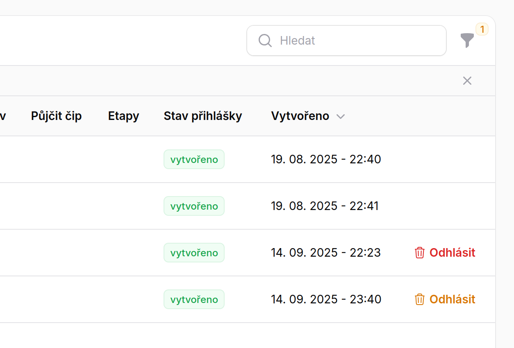

# Jak se odhlásit ze závodu <Badge type="info" text="ČLEN" />

1. Na stránce závodu ve spodní části je dostupný seznam přihlášenýh závodníků.
2. U závodních profilů které máte ve správě je možné tlačítkem **odhlásit** se ze závodu.
3. Po kliknutí na tlačítko se zobrazí dialog potvrzení odhlásení ze závodu.
4. Pokud odhlášení potvrdíte, dojde k odhlášení ze závodu
   - V případě ORIS závodu budete odhlášení z ORIS systému - je vhodné toto zkontrolovat

::: info Záznam o přihláškách
V protokolu o přihláškách budou vedeny záznamy o přihláškách. V přehledu budou videt i odhlášky ze závodů
pro přehled o přihláškách. Přihlášky a odhlášky nejsou nikterak omezeny na jeden závod.
:::

## Co zkontrolovat po odhlášení

Pokud se jedná o závod vedený v ORISu, je potřeba odhlášku zkontrolovat přímo na ORIS stránce.

## Odhlášení závodníka pověřeného k přihlašování

Pokud spravujete závodníky i jinému uživateli, [uživatel vám dal právo ho přihlšovat/odhlašovat](stranka-uzivatelska-nastaveni), tak v této sekci uvidíte **možnost odhlásit** i tyto závodníky

Odkaz a ikona koše pro odhlášení bude pro takové závodníky **oranžová**. U vámi napřímo spravovaných závodníků je naopak ikona a odkaz **červený**.

Příklad je vidět na následujícím obrázku:

