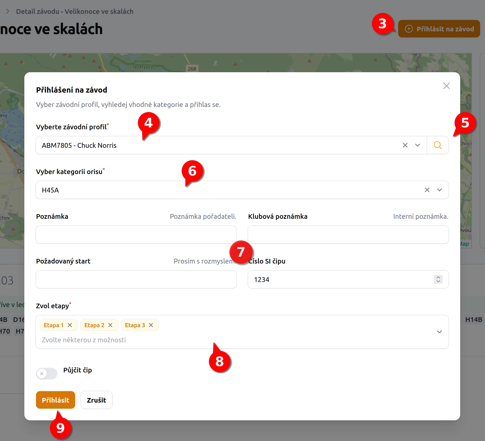

# Jak se přihlásit na závod v ORISu <Badge type="info" text="ČLEN" />

1. V menu **Závod/Akce** přejdu na kalendář závodů.
2. Kliknu na konkrétní závod (kdekoliv na řádku závodu)
3. V kartě závodu vidím potřebné informace o závodu, v pravo nahoře kliknu na tlačítko **Přihlásit na závod**.
4. V otevřeném dialogu zvolím konkrétní závodní profil. Závodníka kterého chci dále přihlašovat. Pod jedním účtem mohu mít vice závodníků.
5. Kliknu na tlačítko **lupy** - načtou se kategorie do kterých mě ORIS dovolí se přihlásit. Pokud závod nezpracovává ORIS, není ikona lupy zobrazena, kategorie nabízeny rovnou.
6. Vyberu konkrétní **kategorii**
7. Doplním všechny ostatní pole jako poznámka, interní poznámka,  číslo čipu ...
8. Pokud se jedná o etapový závod, jsou v rozvíracím menu automaticky vyplněny všechny etapy
    - Etapy mohu křížkem u Etapy odstranit a budu přihlášen pouze do vybraných Etap.
8. Kliknu na tlačítko **Přihlásit**. Tímto jsem přihlášen k závodu.
9. Případně opakuji od bodu 3. pro dalšího závodníka, v případ že chci přihlásit více závodníků na jeden závod.

## Co zkontrolovat po přihlášení

1. V sekci **Uživatel** byste měli vidět konkrétní **přihlášení** pod konkrétním závodním profilem.
2. Na stránkách [ORISu](https://oris.orientacnisporty.cz/) si zkontroluji, že **jsem přihlášen**.

## Řešení potíží s přihlášením

- **Na kartě závodu mi nejde kliknout na tlačítko Přihlásit se**

  Pokud je tlačítko pouze šedé, tak to může mít několik důvodů.
  
    - Na závod jsi už přihlášen. Tzn. ve správě není žádný další závodní profil který bys přihlásil do závodu
    - Závod nemá vyplněny kategorie, nelze se se tedy ani přihlásit

::: warning Automatická aktualizace závodů
Závody se aktualizují jednou za 7 dnů. Pokud organizátor přidá kategorie na poslední chvíli, nemusí zde být tyto kategorie aktuální.
Postup je takový, že zkontroluješ, jestli má závod vyplněny kategorie na ORISu. Pokud ano, dáš vědět odpovědné osobě,
data závodu zaktualizuje ručně.
:::