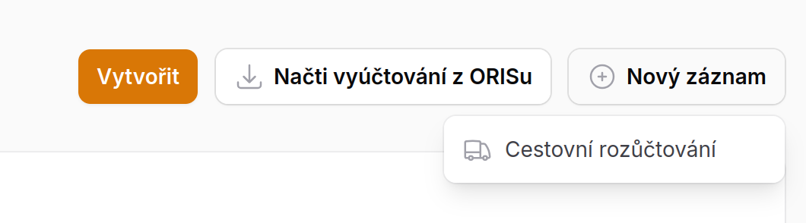
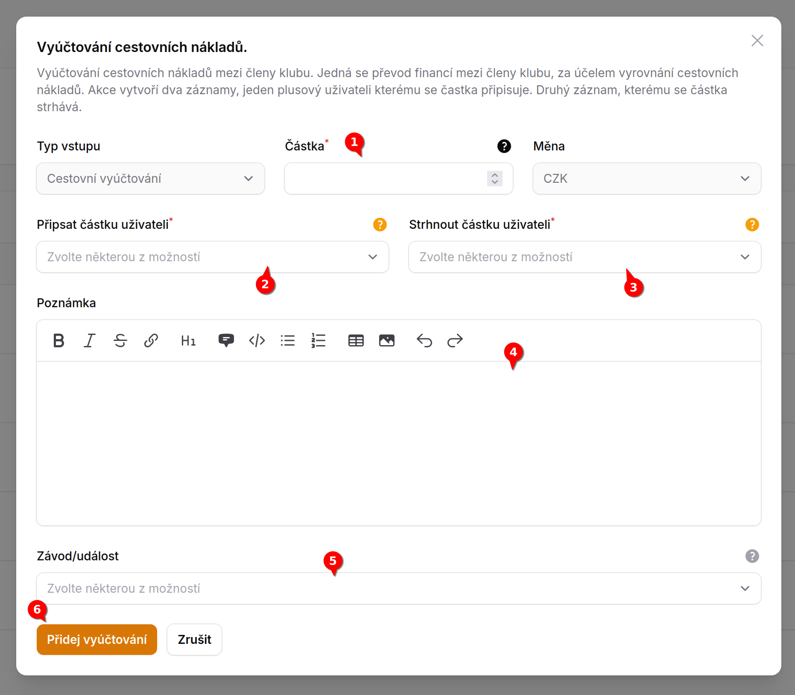

# Jednoduché cestovní vyrovnání <Badge type="info" text="FINANČNÍK" />

Finančník může nově jedním formulářem přerozdělit finance mezi dvojicí uživatelů. Cílem bylo **jednoduše přerozdělit
finance** za **cestovní náklady** mezi členy klubu dohodnutou částkou na kterou se všichni shodli.

## Jak toto provedu

V sekci Vyúčtování akci je nově rozvírací menu **Nový záznam** s jednou akci **Cestovní rozůčtování**

### Pro správné rozůčtování stačí provést tyto akce:

1. Zvolím **plusovou částku**, kerá bude přičtena uživateli
2. Vyberu uživatele, kterému se **povýší** účet o zvolenou částku - částka mu bude připsána
3. Vyberu uživatele, kterému se stejná částka **ztrhne** z virtuálního účtu - částka mu bude stržena
4. Je možné zapsat **poznámku**, která se zobrazí u transkací oběma uživatelům
5. Je možné zvolit k jakému závodu se toto vztahuje
6. **Potvdíme** rozůčtování

---

Uživatelé standardně uvidí záznamy o připsání nebo střžení částky za cestovné.

::: tip Info
Oba záznamy mají **odkaze jeden na druhý**. Záznamy je **možné standardně kdykoliv editovat** v případě nesprávného zadání nebo jiné chyby.
:::