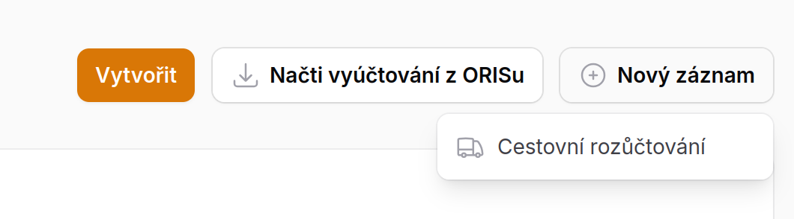
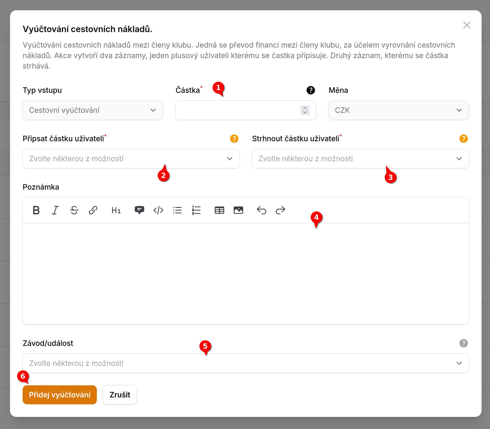

# Jednoduché cestovní vyrovnání <Badge type="info" text="FINANČNÍK" />

Finančník může nově jedním formulářem přerozdělit finance mezi dvojicí uživatelů. Cílem bylo **jednoduše přerozdělit
finance** za **cestovní náklady** mezi členy klubu dohodnutou částkou na kterou se všichni shodli.

## Jak toto provedu

V sekci Vyúčtování akcí je nově rozvírací menu **Nový záznam** s jednou akcí **Cestovní rozúčtování**

### Pro správné rozúčtování stačí provést tyto akce:

1. Zvolím **plusovou částku**, která bude přičtena uživateli
2. Vyberu uživatele, kterému se **povýší** účet o zvolenou částku - částka mu bude připsána
3. Vyberu uživatele, kterému se stejná částka **strhne** z virtuálního účtu - částka mu bude stržena
4. Je možné zapsat **poznámku**, která se zobrazí u transakcí oběma uživatelům
5. Je možné zvolit k jakému závodu se toto vztahuje
6. **Potvrdíme** rozúčtování

---

Uživatelé standardně uvidí záznamy o připsání nebo stržení částky za cestovné.

::: tip Info
Oba záznamy mají **odkaz jeden na druhý**. Záznamy je **možné standardně kdykoliv editovat** v případě nesprávného zadání nebo jiné chyby.
:::