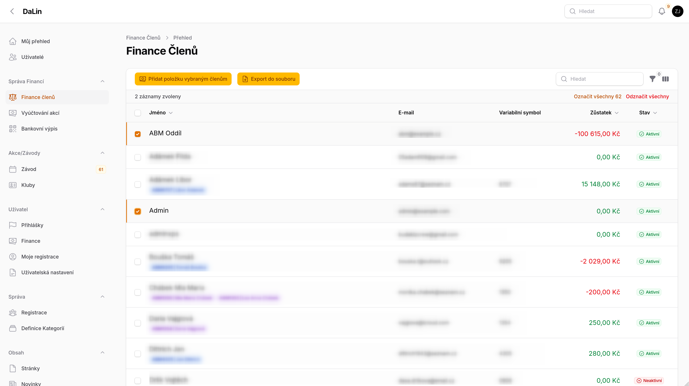
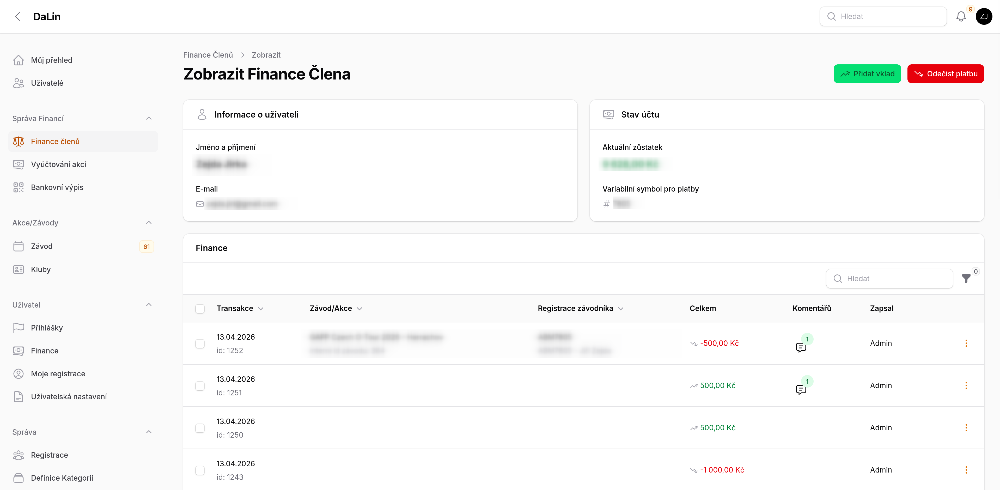

# Finance členů <Badge type="tip" text="FINANČNÍK" />

Stránka **Finance členů** poskytuje finančníkovi a správci klubu kompletní přehled o stavu kont všech členů. Na jednom místě je vidět zůstatek každého člena, jeho variabilní symbol a závodní profily. Odtud lze také provádět ruční finanční operace nebo exportovat data.

## Co stránka zobrazuje

V hlavní tabulce jsou zobrazeni všichni členové s těmito údaji:

- **Jméno** — zobrazeno spolu s aktivními závodními profily (registrační číslo a jméno závodníka)
- **E-mail**
- **Variabilní symbol** — slouží k párování bankovních plateb
- **Zůstatek** — aktuální stav konta v CZK; kladný zůstatek je zeleně, záporný červeně
- **Stav** — zda je člen aktivní nebo neaktivní
 

## Filtry

Tabulku lze filtrovat podle:

- **Stav členství** — aktivní / neaktivní
- **Záporný zůstatek** — zobrazí pouze členy s dluhem
- **Nulový zůstatek** — zobrazí členy s nulovým kontem
- **Kladný zůstatek** — zobrazí členy s přeplatkem

## Detail člena

Kliknutím na řádek v tabulce se otevře detail konkrétního člena se dvěma sekcemi:

- **Informace o uživateli** — jméno a e-mail
- **Stav účtu** — aktuální zůstatek a variabilní symbol

Pod těmito informacemi je zobrazen seznam všech finančních transakcí daného člena (pohyby na kontě).

Z detailu lze přejít přímo na zobrazení nebo úpravu konkrétní transakce.

## Ruční finanční operace

### Přidat vklad (jednomu členovi)

Na stránce detailu člena stiskněte tlačítko **Přidat vklad**. Zobrazí se formulář:

1. Vyberte **typ vkladu** — Mimořádný členský vklad / Počáteční vklad / Členský příspěvek
2. Zadejte **částku** (kladné číslo v CZK)
3. Volitelně přidejte **poznámku**
4. Potvrďte tlačítkem **Přidat vklad**

Částka bude okamžitě připsána na konto člena.

### Odečíst platbu (jednomu členovi)

Na stránce detailu člena stiskněte tlačítko **Odečíst platbu**. Zobrazí se formulář:

1. Vyberte **typ platby** — Výdej / Členský příspěvek / Cestovní náklady
2. Zadejte **částku** (kladné číslo — systém ji automaticky odečte)
3. Volitelně přidejte **poznámku**
4. Potvrďte tlačítkem **Odečíst platbu**

### Hromadné přidání položky

V hlavní tabulce označte více členů (zaškrtávátka vlevo) a stiskněte **Přidat položku vybraným členům**.

1. Vyberte **typ položky** (Členský příspěvek / Mimořádný členský vklad / Výdej / Počáteční vklad / Cestovní náklady)
2. Zadejte **částku** — kladná hodnota znamená příjem, záporná výdaj
3. Volitelně přidejte **poznámku**
4. Potvrďte tlačítkem **Přidat položku**

Operace se provede najednou pro všechny označené členy.

::: warning Hromadná operace
Hromadné přidání položky nelze vrátit zpět jedním kliknutím. Před potvrzením zkontrolujte výběr členů i zadanou částku.
:::

## Export dat

Z hlavní tabulky lze exportovat přehled členů do souboru. Export obsahuje:

- Jméno člena
- E-mail
- Variabilní symbol
- Zůstatek v CZK
- Stav (aktivní / neaktivní)

Pro spuštění exportu označte požadované členy a klikněte na **Export do souboru**.

::: tip Přístup ke stránce
Stránka Finance členů je dostupná pouze pro role **Finančník**, **Správce klubu** a **Super Admin**.
:::
