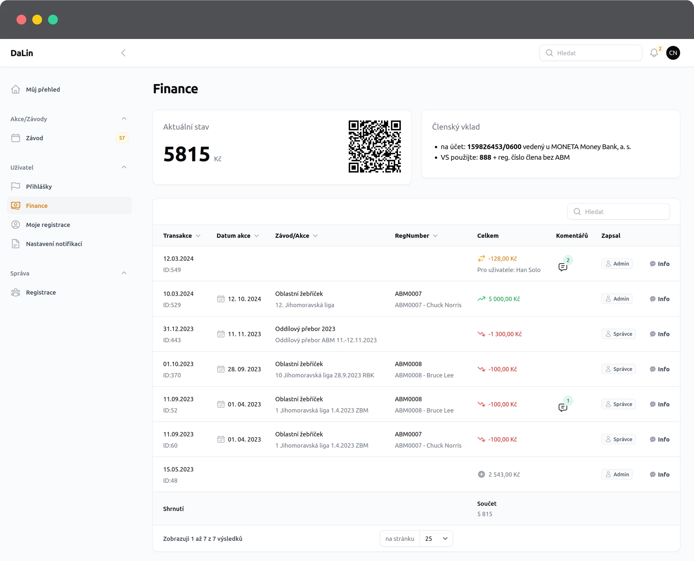

# Finance <Badge type="tip" text="ČLEN" />

Na stránce financí můžete kontrolovat stav osobních účtů, případně vznášet rozpor k dořešení.

### Co přehled zobrazuje
V záhlaví se generuje QR kód pro platbu konkrétního člena s variabilním symbolem platným daného člena.

Uživatel vidí stav konta a číslo účtu kam zasílat řádné i mimořádné členské příspěvky.

----

**V detailu je možné vidět:**

 - **ID transakce**, vhodné pokud se bavíme o nějaké konkrétní transakci
 - **datum akce** ke které se pohyb vztahuje
 - **název akce**
 - pro jakou **registraci** je platba platná
 - pohyb na účtu
 - **poznámka** pokud byla vytvořená
 - **kdo** danou transakci provedl
 - **úplné informace** k transakci

## Jak správně zaslat mimořádný členský vklad

Na stránce uživatelé vidí aktuální podobu variabilního symbolu. Jedná se o:
- předčíslí (např.: **888**)
- a následně 4 čísla z registrace uživatele (např.: **0101**)

Například tedy: **8880101**. Podobný variabilní symbol se generuje uživatelům do QR kódu.

Platby zaslané pod tímto variabilním symbolem budou automaticky připsány uživateli na účet.

::: tip :bulb: Párování podle VS
Pokud vám banka doplňuje variabilní symbol s doplněním 000 do celkem 10 znaků variabilního symbolu, není v tomto problém. I v tomto případě dojde k **automatickému spárování** transakce.

**Automaticky se bude párovat:**
- **8880101**
- 000**8880101**
:::

Pokud se nepodaří transakci spárovat automaticky, může Finančník transakci napárovat ručně.

----

Prosíme 🙏 o zasílání plateb pod **správným a úplným variabilním symbolem**.

