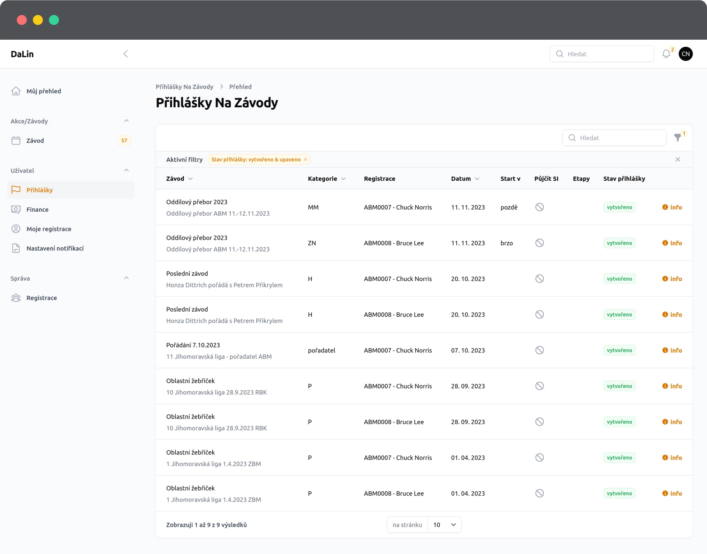

# Přihlášky na závody

Na stránce vidí uživatel všechny přihlášky na závody. Výchozí filtr je nastaven na aktivní přihlášky.
Pokud smažete aktivní filtr, uvidíte v přehledu všechny přihlášky i stornované.

## Údaje v přehledu
 - **Název závodu**, případně alternativní název závodu (pokud je uveden)
 - **Kategorie**, do které jste přihlášen
 - **Konkrétní registrace**, vhodné rozlišení pokud spravuji více závodníků
 - **Datum přihlášky**, kdy jsem se na závod přihlásil
 - **Datum přihlášky**, kdy jsem se na závod přihlásil
   - Podrobnosti jako: 
     - požadavek na start
     - bylo požadováno zapůjčení čipu
     - výčet etap
     - stav přihlášky
 - :information_source: **Info** obsahuje podrobnosti, které se do tabulky nevešly

::: tip :bulb: Rychly odkaz na závod
**Název akce** je zároveň **odkaz** na konkrétní závod, kde můžete zkontrolovat aktuální dění na kartě závodu nebo se třeba odhlásit.
:::

## Další akce
Na této stránce nejsou dostupné žádné další akce. Slouží převážByL6Syyxně ke kontrole, na jaký závod jsem přihlášen. Případně historicky kde jsem závodil.