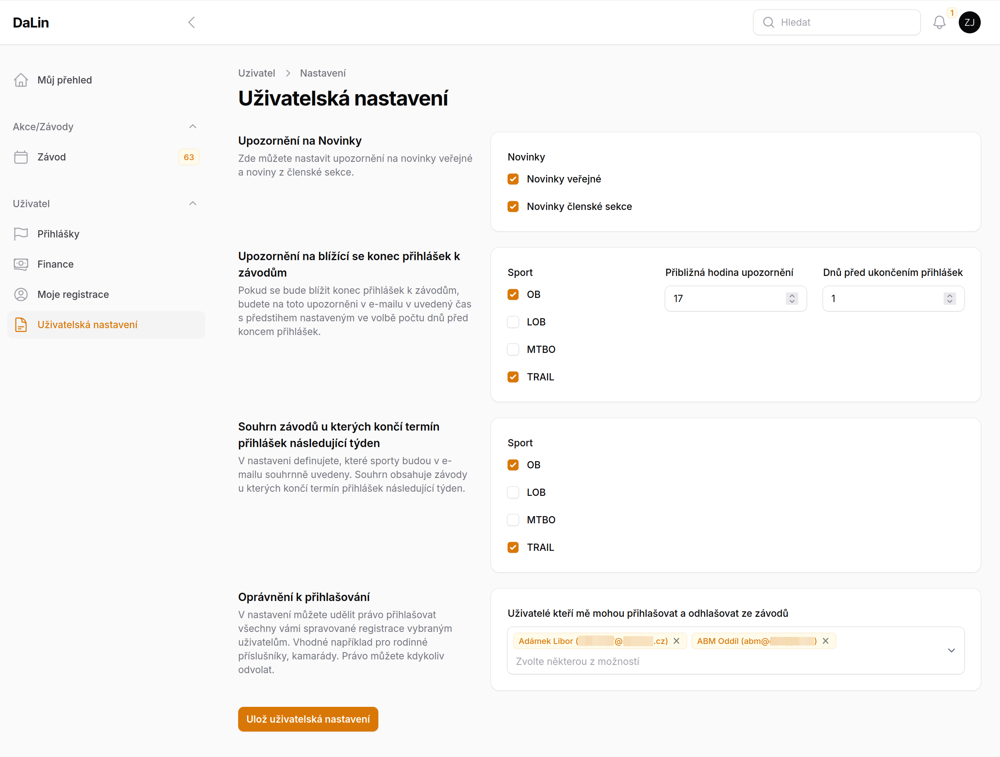

# Uživatelská nastavení <Badge type="tip" text="ČLEN" />

Jednoduchá stránke **Uživatelská nastavení** zobrazuje předefinované kanály notifikaci s uživatelskou volbou co kdy se má posílat.

## Co přehled zobrazuje
 - je zde možné zapnout/vypnout **notifikace** na **novinky**.
 - notifikace na **blížící se konec přihlášky** v různých termínech
 - **týdenní souhrn** závodů zasílaný v neděli.

## Oprávnění k přihlášení
V této sekci je možné vybrat uživatele, kteří vás mohou **přihlašovat** nebo **odhlašovat** z **jakýchkoliv** závodů.

Toto nastavení se hodí v případě rodiných příslušníků nebo blízkých přátel. Tito vás budou moci přihlašovat nebo
odhlašovat ze závodů. 

Toto **oprávnění můžete kdykoliv libovolně odvolat** smazáním uživatelů (_křížek_) a uložením nastavení.

::: tip
Pokud naopak toto právo někdo přidělí vám, udivíte takové registrace v přihláškovém formuláři podbarvené oranžově.

Stejně tak uvidíte v seznamu přihlášených oranžově možnost tyto závodníky odhlásit viz upřesnění na stránce přihlášek.
:::

