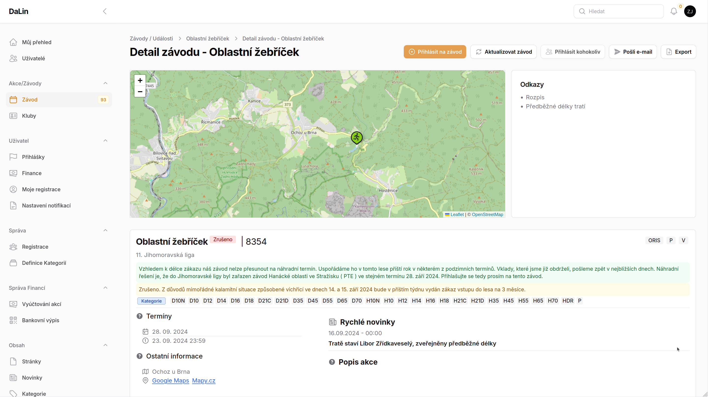

# Závody <Badge type="tip" text="ČLEN" />

Detail závodu zobrazuje podrobné informace vybraného závodu. Pokud se jedná o závod z ORISu, je tento detail pravidelně aktualizován.

### Co přehled zobrazuje
V závislosti roli uživatele se mohou některé tlačítka nezobrazovat.

**V detailu je možné vidět:**

 - **situační mapu** s body zájmu, po kliknutí na body zobrazí jejich detail
 - **odkazy** - jedná se o Oris odkazy a Oris linky na dokumenty/stránky a pod.
 - **přehled závodu** - kategorie, doplňové služby odkaz na ORIS závodu, výsledky a přihlášky
 - dále jsou pravidelně stahovány novinky a může zde být popis akce
 - na spodní straně detailu zévodu je vidět **žurnál přihlášek**. Přihlášení členové vidí kdo je přihlášen, v žurnálu je možné se i [odhlásit](jak-se-odhlasit-ze-zavodu.md).

-----

::: tip Pridat závod
Počínaje rolí Člen mají tito uživatelé možnost se [přohlásit na závod](jak-se-prihlasit-na-oris-zavod.md). Pokud nejsou data aktuální, je možné aktualizaci vyvolat ručně.
:::

##### Uživatelé s vyšším oprávněním mohou
 - **přihlásit kohokoliv** z oddílu
 - **poslat informační e-mail** přihlášeným uživatelům
 - **exportovat** seznam přihlášených do *.xlsx sešitu

