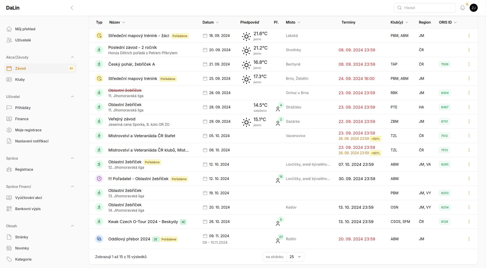

# Závody <Badge type="tip" text="ČLEN" />

Hlavní stránka pro zobrazení **závodů a akcí** klubu. Stránka zobrazuje **přehled o nadcházejících akcích**. Pomocí filtrů jsou akce
omezeny **14 dnů zpět** a závody které jsou pro klub zařazeny do kalendáře. 

Pokud by nějaký závod nebo akce na kterou se chcete přihlásit chyběl, prosím kontaktujte odpovídající osobu k doplnění.

Na stránce [Závody/Akce](stranka-zavody-akce) jsou vedeny všechny závody na které je možné se přihlašovat.

### Co přehled zobrazuje
V závislosti na šířce obrazovky se mohou některá data nezobrazovat. Typicky na telefonu, pro lepší čitelnost.

**V přehledu je možné vidět:**

 - ikonu akce
 - **oficiální název akce**, z názvem se může zobrazovat `pořádáme`, pro etapové **počet etap**
   - pod oficiálním názvem akce je **neoficiální název**, který leckdy upřesní o co se jedná
 - **termín konání akce** v případě vícedenních závodů **od-do**
 - **předpověd počasí** na den akce, braná z [OpenWeatherAPI](https://openweathermap.org/api)
 - **počet přihlášených**
 - **místo centra**
 - **termíny** s **navýšením** plateb a jejich barevné zobrazení
 - **pořádající suběkt**
 - **oblast**
 - **ORIS Id**
 - možnosti

-----

::: tip Pridat závod
Vybrané role pak mohou v horní části najít tlačítka na možnost [přidání závodu z ORISu](jak-pridat-zavod.md), nebo vlastního závodu.
:::

